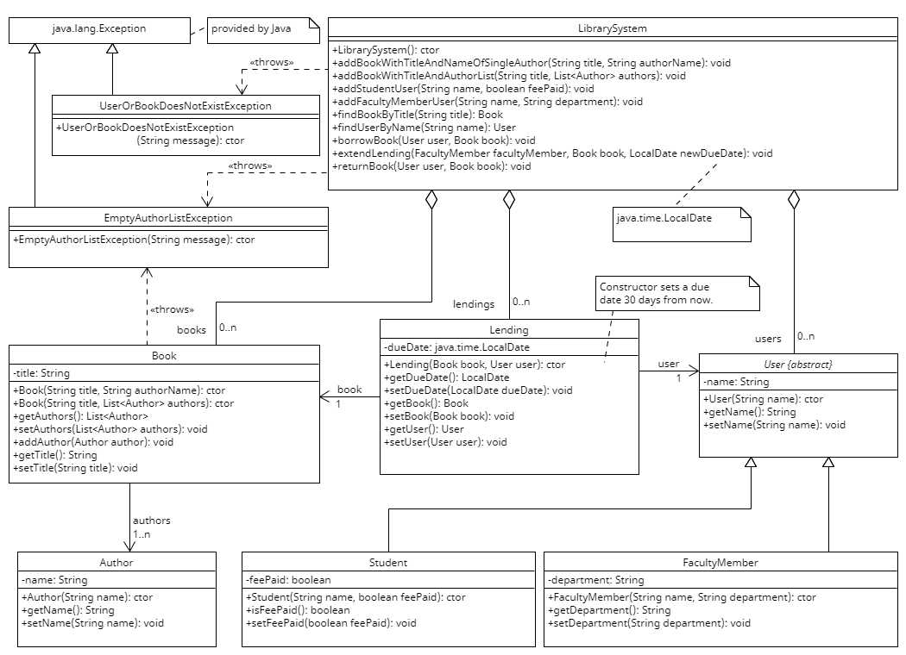

# Design of the Program

The program is designed based on OO principles. We coded the program according to the following design:



Unfortunately, this diagram is not complete. We added 3 different design patterns, which are the singleton pattern, observer pattern, and the command pattern. In the sections below, you can find more detail on this.

## Singleton Pattern

The `LibrarySystem` class is designed as a Singleton. This means that there can only be one instance of `LibrarySystem` in the application. We chose the Singleton pattern to ensure that all operations are done on a single library system, preventing inconsistencies that could arise from having multiple instances.

Here's how we implemented the Singleton pattern in the `LibrarySystem` class:

```java
public class LibrarySystem {
    private static LibrarySystem instance;

    private LibrarySystem() {
        // private constructor to prevent instantiation
    }

    public static LibrarySystem getInstance() {
        if (instance == null) {
            instance = new LibrarySystem();
        }
        return instance;
    }
}
```

## Observer Pattern

The Observer pattern is used in this project to allow objects to observe other objects' state changes without being tightly coupled to them. This pattern involves two types of entities: Observers and Observables.

In our project, `LibrarySystem` is the Observable. The `Observer` interface is implemented by `NewLibrarySystemUI` class. The observers are notified via an `update` method, for example when a book has been added to the system. Here's a simplified version of how we implemented the Observer pattern:

```java
public interface Observer {
    void update();
}

public interface Observable {
    void addObserver(Observer observer);
    void removeObserver(Observer observer);
    void notifyObservers();
}

public class LibrarySystem extends Observable {
    // Implementation
}

public class NewLibrarySystemUI implements Observer {
    // Implementation
}
```

## Command Pattern

Finally, the Command pattern is used in this project to encapsulate a request as an object. This pattern, in our case, involves three types of entities: Command, Receiver and Invoker.

In our project, the `NewLibrarySystemUI` class is the Invoker and there are multiple Command classes which are stored in the `commands` directory of the project. Some of these include `AddBookMultipleAuthorsCommand`, `AddBookSingleAuthorCommand` and `ReturnBookCommand`. Here's a simplified example of how we implemented the Command pattern:

```java
public interface Command {
    void execute();
}

public class ReturnBookCommand implements Command {
    private LibrarySystem receiver;

    public SpecificCommand(LibrarySystem receiver) {
        this.receiver = receiver;
    }

    public void execute() {
        receiver.action();
    }
}

public class NewLibrarySystemUI {
    private Map<Integer, Command> commands;

    public NewLibrarySystemUI(LibrarySystem librarySystem) {
        this.commands = new HashMap<>();
        this.commands.put(1, new SpecificCommand(librarySystem));
        // Other commands...
    }

    Command command = commands.get(commandKey);
    if (command != null) {
        command.execute();
    }
}
```